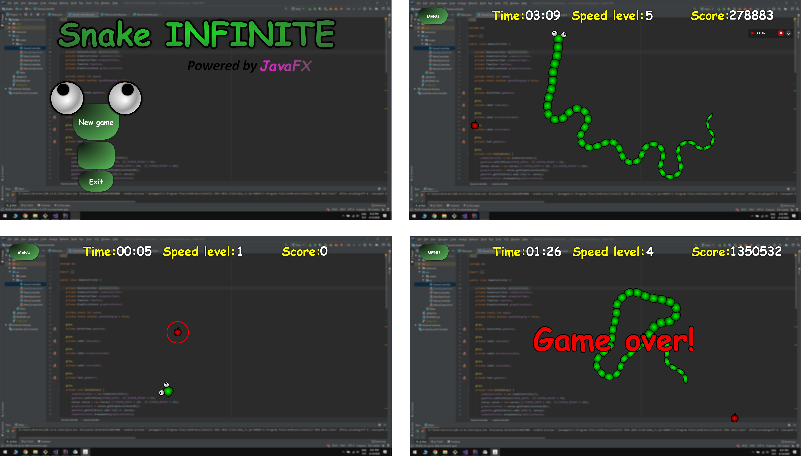

# Snake

> Snake game, which you can run on any customized desktop. After run, game screen makes blur
effect with stage always on top. The game target is to control the snake to eat apples. If
you get apples faster, your point stats are growing up faster. If you don't eat fruit,
you can get some negative points. Hurry up!!!

## Screenshots from the game

## How to play:
* LEFT and RIGHT arrow to direction changing;
* optional UP arrow to get max speed;
	
## Game has implemented:
* collisions with any snake's segment and screen borders;
* blurred screen behind top layer;
* head shaking to imitate real snake motion;
* segment width depends on snake length;
* rendering apples between the screen borders except the actual snake's body;

## To do (development ideas):
* redesign game pop-ups;
* option screen;
* random walls to get the level more difficult;
* better apple design;
* overall optimization (lists, compare methods);
* reduce game library requirements;

## Requirements (will be changed):
The game was created and tested on Windows 10 with 1920x1080px screen resolution.
* Java SE 13
* JavaFX 13

## Contact
Created by Mateusz Łyszkiewicz  
mat.lyszkiewicz@gmail.com
